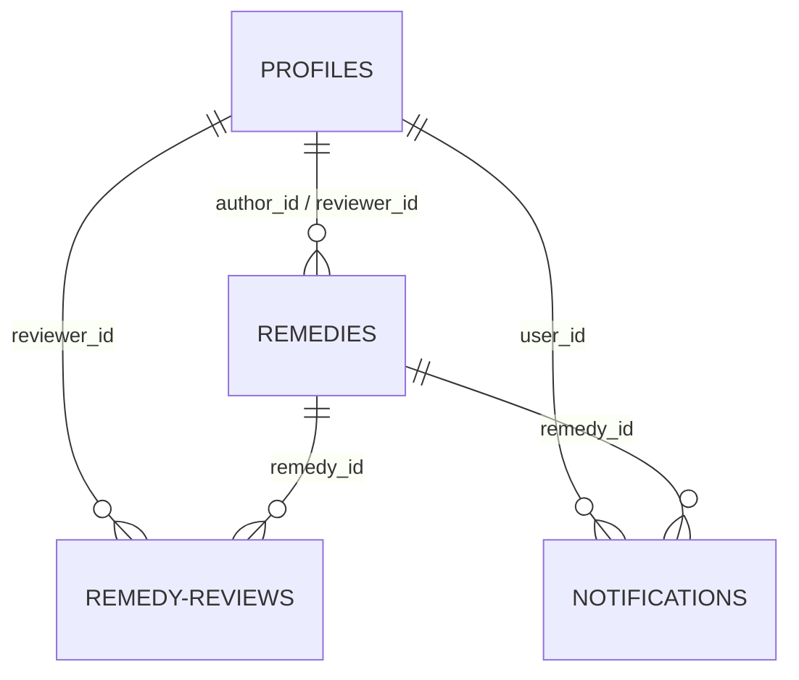

# SafeMed Backend API Server 🚀

This is the Express API server for SafeMed Nepal. It acts as the secure gateway to the Supabase PostgreSQL database, handles JWT token validation for medical staff, updates profiles, logs audits, and manages Nodemailer SMTP email alerts.

---

## ⚙️ Configuration & Environment Variables

Create a `.env` file in the root of the `backend/` directory with the following variables:

```properties
# Supabase Configuration
SUPABASE_URL=https://your-project.supabase.co
# service_role key is required to bypass Row-Level Security policies for administrative tasks
SUPABASE_SERVICE_ROLE_KEY=your-service-role-key

# Server Port & CORS
PORT=3001
ALLOWED_ORIGIN=http://localhost:5173

# Admin Recipient for Reviewer Applications
CONTACT_EMAIL=rishavc957@gmail.com

# SMTP Configurations for Gmail Onboarding (Optional - uses mock simulation if empty)
SMTP_SERVICE=gmail
SMTP_USER=your-gmail-address@gmail.com
SMTP_PASS=xxxx-xxxx-xxxx-xxxx  # 16-character Google App Password
```

---

## 🔒 Authentication & Authorization

All state-modifying requests require JWT authorization.
* **Header format**: `Authorization: Bearer <access_token>`
* **Validation process**: The token is decoded and verified against Supabase Auth (`supabase.auth.getUser()`).
* **Role Check**: Endpoints modifying remedies verify if the user's role is `admin` or `doctor` in the database.

---

## 🛣️ API Endpoints

### 1. Remedies Router (`/api/remedies`)

| Method | Endpoint | Description | Auth Required |
|:---|:---|:---|:---|
| **GET** | `/api/remedies` | Fetch paginated remedies. Supports filter by `symptom` and admin preview of drafts. | No |
| **GET** | `/api/remedies/:id` | Fetch detailed information of a single remedy. | No |
| **POST** | `/api/remedies` | Create a new remedy draft. | Yes |
| **PATCH** | `/api/remedies/:id` | Modify remedy title, warnings, ingredients, or steps. | Yes |
| **DELETE** | `/api/remedies/:id` | Permanently delete a remedy from the database. | Yes (Admin Only) |
| **PATCH** | `/api/remedies/:id/status` | Update status (`approved`, `revision_required`, `rejected`, `published`) and log notes. | Yes |

#### Payload Examples:
* **POST `/api/remedies`**:
  ```json
  {
    "title_en": "Lemon Water for Sore Throat",
    "title_ne": "घाँटी दुख्दा कागती पानी",
    "symptom": "sore_throat",
    "ingredients_en": ["Lemon", "Warm Water", "Honey"],
    "ingredients_ne": ["कागती", "मनतातो पानी", "मह"],
    "steps_en": ["Squeeze half a lemon into warm water.", "Mix 1 spoon honey.", "Drink twice a day."],
    "steps_ne": ["मनतातो पानीमा आधा कागती निचोर्नुहोस्।", "एक चम्चा मह मिसाउनुहोस्।", "दिनको दुई पटक पिउनुहोस्।"]
  }
  ```

---

### 2. Clinical Reviews Router (`/api/remedies/:id/reviews`)

| Method | Endpoint | Description | Auth Required |
|:---|:---|:---|:---|
| **GET** | `/api/remedies/:id/reviews` | Retrieve verification audit history and doctor comments. | No |
| **POST** | `/api/remedies/:id/reviews` | Log a medical professional review vote and comments. | Yes |

#### Payload Example:
* **POST `/api/remedies/:id/reviews`**:
  ```json
  {
    "status": "approved",
    "comments": "The ingredients are safe. Remind patients not to use boiling water to avoid destroying honey nutrients."
  }
  ```

---

### 3. Profiles Router (`/api/profile`)

| Method | Endpoint | Description | Auth Required |
|:---|:---|:---|:---|
| **PATCH** | `/api/profile` | Update doctor/admin profile metadata (name, credentials, avatar URL). | Yes |

#### Payload Example:
* **PATCH `/api/profile`**:
  ```json
  {
    "full_name": "Dr. Subhash Thapa",
    "credentials": "MBBS, MD (Internal Medicine)",
    "avatar_url": "https://example.com/avatar.png"
  }
  ```

---

### 4. Reviewer Onboarding Application (`/api/contact`)

| Method | Endpoint | Description | Auth Required |
|:---|:---|:---|:---|
| **POST** | `/api/contact` | Submit a request to become a medical reviewer. logs record and dispatches SMTP email. | No |

#### Payload Example:
```json
{
  "name": "Dr. Alina Shrestha",
  "email": "alina@hospital.org",
  "credentials": "MD (Pediatrics)",
  "organization": "Kanti Children's Hospital",
  "nmc_number": "18492",
  "credential_link": "https://drive.google.com/drive/folders/your-credentials-id",
  "message": "Interested in reviewing child healthcare remedy instructions."
}
```

---

### 5. Notifications Router (`/api/notifications`)

| Method | Endpoint | Description | Auth Required |
|:---|:---|:---|:---|
| **GET** | `/api/notifications` | Fetch the current user's last 50 notifications. | Yes |
| **PATCH** | `/api/notifications/:id` | Toggle status (`read` or `unread`) of a single notification. | Yes |
| **POST** | `/api/notifications/mark-all-read` | Mark all unread notifications as read. | Yes |

#### Payload Examples:
* **PATCH `/api/notifications/:id`**:
  ```json
  {
    "status": "read"
  }
  ```

---

## 📧 Email Notification Service (SMTP)

* **Mode 1: Mock/Simulation (Default)**:
  If `SMTP_USER` and `SMTP_PASS` are absent, the server automatically boots in developer preview mode. Submitted applications will output a temporary mail preview link in the console (e.g. via `Ethereal Email`) so you can inspect the email body in your browser without entering credentials.
* **Mode 2: Live Mail Delivery**:
  When SMTP credentials are set, Nodemailer connects to Gmail and immediately dispatches professional, HTML-formatted reviewer applications to the address specified in `CONTACT_EMAIL`.

---

## 🗄️ Supabase Database Architecture & Schema

The PostgreSQL database runs inside Supabase with Row-Level Security (RLS) active on all tables. 



### 1. Profiles Table (`public.profiles`)
Links directly with Supabase's internal `auth.users` table. When a user registers, a Postgres trigger automatically generates a profile row with role `'user'`.

| Column | Type | Constraints | Description |
| :--- | :--- | :--- | :--- |
| `id` | `UUID` | `PRIMARY KEY`, `REFERENCES auth.users(id)` | Matches the Auth User ID |
| `email` | `TEXT` | `NOT NULL` | User's email address |
| `full_name` | `TEXT` | - | Display name |
| `role` | `TEXT` | `DEFAULT 'user'`, `CHECK (role IN ('admin','reviewer','user'))` | Access permissions level |
| `credentials` | `TEXT` | - | Academic titles (e.g. MBBS, MD) |
| `avatar_url` | `TEXT` | - | Link to profile picture |
| `created_at` | `TIMESTAMPTZ`| `DEFAULT now()` | Creation date |

* **RLS Policies**:
  * Users can read all profiles (`role` checks, etc.).
  * Users can update only their own profile details (`auth.uid() = id`).

---

### 2. Remedies Table (`public.remedies`)
Stores all remedy specifications, instructions, warnings, and states.

| Column | Type | Constraints | Description |
| :--- | :--- | :--- | :--- |
| `id` | `UUID` | `PRIMARY KEY`, `DEFAULT gen_random_uuid()` | Remedy unique ID |
| `title_en` | `TEXT` | `NOT NULL` | Title in English |
| `title_ne` | `TEXT` | - | Title in Nepali |
| `description_en`| `TEXT` | `NOT NULL` | English description |
| `description_ne`| `TEXT` | - | Nepali description |
| `ingredients_en`| `TEXT[]` | - | English ingredients list array |
| `ingredients_ne`| `TEXT[]` | - | Nepali ingredients list array |
| `steps_en` | `TEXT[]` | `NOT NULL` | English step-by-step array |
| `steps_ne` | `TEXT[]` | - | Nepali step-by-step array |
| `precautions_en`| `TEXT[]` | - | English precautions array |
| `precautions_ne`| `TEXT[]` | - | Nepali precautions array |
| `warnings_en` | `TEXT` | - | English doctor-visit warnings |
| `warnings_ne` | `TEXT` | - | Nepali doctor-visit warnings |
| `symptom_tags` | `TEXT[]` | - | Symptoms search indexing array |
| `video_url` | `TEXT` | - | Optional video guide link |
| `source_url` | `TEXT` | - | Reference documentation URL |
| `source_label` | `TEXT` | - | Descriptive source text label |
| `status` | `TEXT` | `DEFAULT 'draft'`, `CHECK (status IN ('draft','pending','needs_revision','rejected','published'))` | Verification state |
| `author_id` | `UUID` | `REFERENCES profiles(id)` | Author user profile link |
| `reviewer_id` | `UUID` | `REFERENCES profiles(id)` | Verifying doctor profile link |
| `reviewer_name`| `TEXT` | - | Cached reviewer full name |
| `review_notes` | `TEXT` | - | Direct comments for revisions |
| `is_deleted` | `BOOLEAN` | `DEFAULT false` | Soft delete marker |
| `deleted_by` | `UUID` | `REFERENCES profiles(id)` | Soft delete operator |
| `deleted_at` | `TIMESTAMPTZ`| - | Date of deletion |
| `verified_at` | `TIMESTAMPTZ`| - | Date of verification publish |
| `created_at` | `TIMESTAMPTZ`| `DEFAULT now()` | Creation timestamp |
| `updated_at` | `TIMESTAMPTZ`| `DEFAULT now()` | Update timestamp |

* **RLS Policies**:
  * Anyone can select published, non-deleted remedies.
  * Owners (`author_id = auth.uid()`) and reviewers/admins can select drafts.
  * Reviewers and Admins can update status, while owners can only update their own drafts.

---

### 3. Remedy Reviews Table (`public.remedy_reviews`)
Logs clinical review votes and comments from doctors on specific remedies.

| Column | Type | Constraints | Description |
| :--- | :--- | :--- | :--- |
| `id` | `UUID` | `PRIMARY KEY`, `DEFAULT gen_random_uuid()` | Review log unique ID |
| `remedy_id` | `UUID` | `NOT NULL`, `REFERENCES remedies(id) ON DELETE CASCADE` | Link to the remedy |
| `reviewer_id` | `UUID` | `NOT NULL`, `REFERENCES profiles(id) ON DELETE CASCADE` | Link to the doctor |
| `decision` | `TEXT` | `NOT NULL`, `CHECK (decision IN ('approve','needs_revision','reject'))` | Medical vote |
| `comment` | `TEXT` | - | Review feedback comments |
| `created_at` | `TIMESTAMPTZ`| `DEFAULT now()` | Date created |
| `updated_at` | `TIMESTAMPTZ`| `DEFAULT now()` | Date updated |
| **Index** | `UNIQUE` | `(remedy_id, reviewer_id)` | One review per doctor per remedy |

* **RLS Policies**:
  * Authenticated users can view reviews.
  * Reviewers can insert/update/delete their own reviews, and Admins can manage all.

---

### 4. Reviewer Onboarding Applications Table (`public.reviewer_applications`)
Stores submission forms from external doctors seeking to join the SafeMed platform.

| Column | Type | Constraints | Description |
| :--- | :--- | :--- | :--- |
| `id` | `UUID` | `PRIMARY KEY`, `DEFAULT gen_random_uuid()` | Application unique ID |
| `name` | `TEXT` | `NOT NULL` | Applicant name |
| `email` | `TEXT` | `NOT NULL` | Applicant contact email |
| `organization` | `TEXT` | - | Hospital or Clinic affiliation |
| `credentials` | `TEXT` | `NOT NULL` | Qualifications (e.g. MBBS) |
| `nmc_number` | `TEXT` | - | Nepal Medical Council registration No. |
| `credential_link`| `TEXT` | `NOT NULL` | Mandatory link to folder/documents |
| `message` | `TEXT` | `NOT NULL` | Motivation message |
| `status` | `TEXT` | `DEFAULT 'pending'`, `CHECK (status IN ('pending','approved','rejected'))` | Request state |
| `created_at` | `TIMESTAMPTZ`| `DEFAULT now()` | Application timestamp |

* **RLS Policies**:
  * Anyone can submit an application (INSERT).
  * Only admins can select/view reviewer applications.

---

### 5. In-App Notifications Table (`public.notifications`)
Feeds real-time system alerts to authenticated staff.

| Column | Type | Constraints | Description |
| :--- | :--- | :--- | :--- |
| `id` | `UUID` | `PRIMARY KEY`, `DEFAULT gen_random_uuid()` | Notification unique ID |
| `user_id` | `UUID` | `NOT NULL`, `REFERENCES profiles(id) ON DELETE CASCADE` | Link to recipient |
| `remedy_id` | `UUID` | `REFERENCES remedies(id) ON DELETE SET NULL` | Reference remedy |
| `title_en` | `TEXT` | `NOT NULL` | English alert title |
| `title_ne` | `TEXT` | `NOT NULL` | Nepali alert title |
| `message_en` | `TEXT` | `NOT NULL` | English description |
| `message_ne` | `TEXT` | `NOT NULL` | Nepali description |
| `type` | `TEXT` | `NOT NULL`, `CHECK (type IN ('status_change','new_review','new_remedy'))` | Trigger category |
| `status` | `TEXT` | `DEFAULT 'unread'`, `CHECK (status IN ('unread','read'))` | Read tracking state |
| `created_at` | `TIMESTAMPTZ`| `DEFAULT now()` | Timestamp |

* **RLS Policies**:
  * Users can only select (`SELECT`) and update (`UPDATE` - mark as read) their own notifications (`auth.uid() = user_id`).

